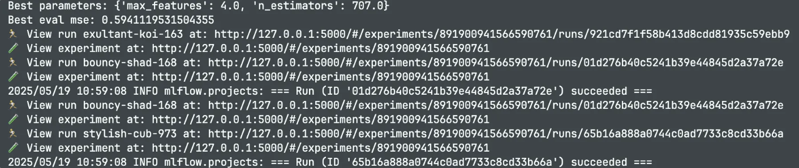
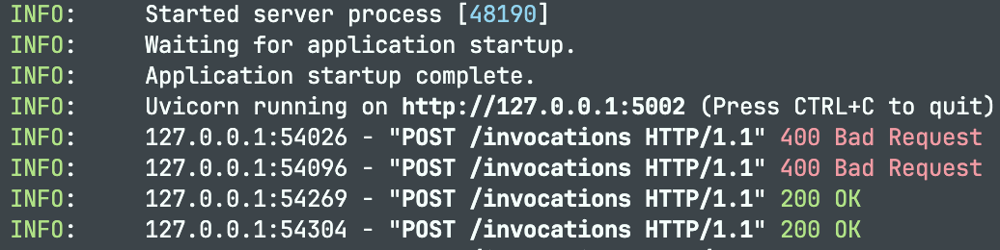
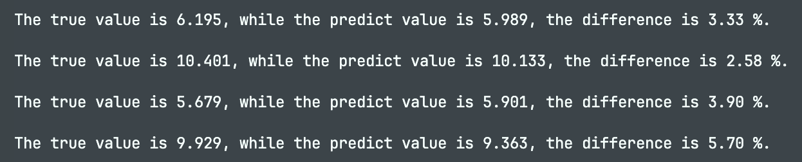

# 由 Mlflow管理的 SOC 数据模型

## 项目构成

```python
    ├── mlruns                  # .gitignore 运行文件
    ├── MLproject               # Mlflow 项目文件
    ├── data.csv                # 数据文件 
    ├── data_prepare.py         # 数据预处理

    ├── main.py                 # pipeline 主入口

    ├── train_model.py          # 训练模型
    ├── pipeline_utils.py       # pipeline运行组件
    ├── post_test.py            # 模型post测试程序
    ├── post_test.sh            # 模型测试shell脚本
    
    ├── conda_env.yaml          # conda 环境
    ├── python_env.yaml         # python环境 
    ├── requirements.txt        # python依赖

    └── README.md               # 自述
```

## 介绍

  本项目通过分析来自玉米（田间地点数量，Nsite = 4,906）、小麦（Nsite = 4,448）和水稻（Nsite = 4,308）的数万次对照田间试验的数据，这些试验分布在中国所有主要种植区，涵盖广泛的气候带和土壤类型。根据当地农业专家和训练有素的推广人员对关键作（包括杂草、病虫害控制、栽培、耕作、播种日期、播种密度、补充灌溉和收获）的一致现场指导和建议，通过实施推荐的最佳管理实践，最大限度地减少了由于农场之间管理差异而导致的产量变化。每个田间试验地点都有 0、0.5、1.0 和 1.5 倍最佳氮 （N） 施用量的处理，结合最佳磷 （P2O5） 和钾 （K2O） 以及不施肥的处理。SOC 和产量的气候、教育、管理和地形协变量作为机器学习（随机森林）模型的解释变量提供，研究这些因素对作物产量的影响。

  特征变量为各项因素，预测变量为产量。

## Mlflow 全流程

### 快速运行

安装 mlflow：

```python
pip install mlflow
```

启动跟踪服务器：

```python
mlflow ui 
```

或是：

```python
mlflow server --host 127.0.0.1 --port 5000
```

 然后在本项目根目录下运行：

```python
mlflow run . --experiment-name "MLflow_SOC_hyperopt"
```

届时，mlflow 将启动多个运行，执行整个 pipeline 流程，包括数据预处理、模型训练等。

首次运行时，将自动按照 conda.yaml 中的需求创建虚拟环境并安装依赖库，安装完成后将自动激活环境并运行。

### 命令行参数

每个文件都提供了单独作为入口时运行的命令行参数，以 main.py 为例

```python
 # MLproject file
 
 main:
    parameters:
      file_path: {type: str, default: "./data.csv"}
      crop_type: {type: str, default: "Maize"}
      hyperopt: {type: bool, default: False}
    command: "python main.py --file-path {file_path} --crop-type {crop_type} --hyperopt {hyperopt}"
```

上述参数取自 MLproject 文件，main 代表项目入口，可替换为其他.py 文件。parameters 参数表示该文件可选的特殊参数，均有默认值。若要以 main 为入口，运行自动超参数调优，则只需要在命令行中单独添加 —hyperopt true 参数即可

### 自动超参数优化

添加指定参数即可运行自动超参数优化形式的模型训练。

```python
mlflow run . --experiment-name "MLflow_SOC_hyperopt" \
--entry-point main  \
-P crop_type="Rice"  \
-P hyperopt=true
```

### 打开跟踪服务器

pipeline 中自动启用了 Mlflow 提供的跟踪服务器，默认地址为 http://localhost:5000 ，打开可以看到刚刚运行的实验，点击实验名称“MLflow_SOC_hyperopt”即可看到此实验刚刚的所有运行。

同时，命令行内也会有多个实验运行成功的提示，包括一个实验地址和多个运行的链接，单独点击运行链接可以看到不同入口打开的运行状态，它们同属于一个实验，main 开启的运行为父运行，其余为子运行。

### 具体参考

可参考 mlflow 官方文档进一步了解此跟踪服务器的信息。

https://mlflow.org/docs/latest/getting-started/intro-quickstart/

## 实验结果

### 运行结果



上图为一个超参数优化实验的运行结果，可以看到最优参数为 max_features = 4，n_estimators（即随机森林决策树数量）为 707，采用此参数的最佳 MSE 为 0.59，这组参数下的效果非常显著。

下面即 3 个运行的报告地址，可以分别点击查看记录的参数内容，点开实验链接可以查看模型状态。

### 测试模型

训练好模型后即可进行测试，post_test.py中提供了测试案例，在运行post_test.py 之前需要先用 mlflow部署为本地推理服务器，运行：

```python
mlflow models serve -m runs:/<run_id>/model -p 5000
```

例如：

```python
mlflow models serve -m "models:/SOC_rf_model/3" --port 5002
```

其中 models:中需要填写注册模型名称，/3 为版本（version），注册模型名称可以在跟踪服务器中自行修改或者从 train_model.py 中修改：

```python
# train_model.py line:213-220

mlflow.sklearn.log_model(
            sk_model=rf_model,
            artifact_path="model",
            signature=signature,
            input_example=train_X,
            # registered_model_name="SOC_rf_model",  # 取消注释即可将本次训练模型注册
        )
```

部署启动后，可在命令行中看到服务启动：



运行 post_test.py 或 post_test.sh 可向服务器发起 POST 请求，在命令行中可看到响应。



可以看到，预测产量 Yield 与实际数据的表现，差异很小。